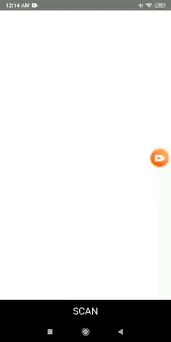
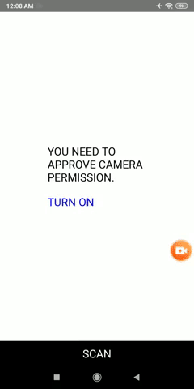

# UI Letdown React
React Native QR Code app with Camera2 API from Android and Zxing library supported




## Install
### iOS
```
pod install
```
### Android
```
Selecting Refactor > Migrate to AndroidX from the menu bar.
```
## Feature
  - QR / Barcode detecting both Android & iOS
  - Flash
  - Auto focus

## Tech
  - Hook
  - Functional Programming
  - Bridging between JS and Native
  - Native UI View
 
## Library
* [Zxing](https://github.com/zxing/zxing) 
